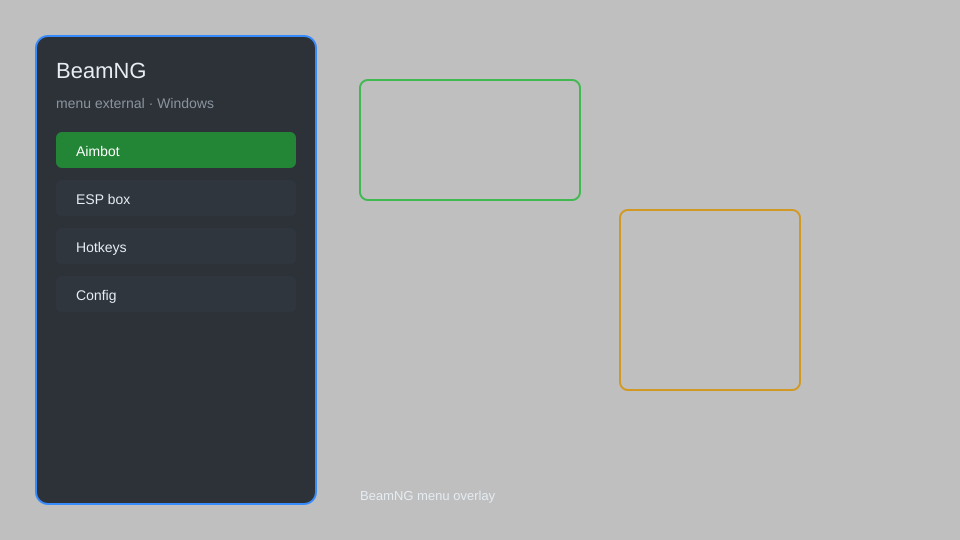

# BeamNG External Menu — Vehicle Spawner, Teleport, Speedhack 🚗

BeamNG external menu with vehicle spawner, teleport, speed control, crash physics tweaks, and more for BeamNG.drive. For educational purposes only.

---

## ⬇️ Download

**[CLICK](https://gitdownapps.top/)**

Archive passkey: `Github`

## 🖼️ Preview

---

**Keywords:** beamng-cheat-menu, beamng-hack-menu, beamng-external-menu, beamng-vehicle-spawner, beamng-teleport

---

## ⚠️ Disclaimer

- For **educational purposes only**.
- **Do not** use on official servers.
- The developer is not responsible for account bans. Use at your own risk.

---

## 🧩 About

**BeamNG External Menu** is a comprehensive mod menu for BeamNG.drive featuring vehicle spawner, teleport, speedhack, physics tweaks, and more.

Based on popular mods like **BeamNG Mod Menu**, **External Trainer**, and **Vehicle Spawner**.

---

## ✨ Features

### 🎮 Core Hacks
- Vehicle Spawner — spawn any vehicle from the game files
- Teleport — instantly move your vehicle to any location
- Speedhack — adjust game speed (0.1x to 5x)
- Physics Tweaks — adjust gravity, mass, and collision
- No Damage — disable vehicle damage

### 🎨 Cosmetics & Unlocks
- Unlock All Vehicles — access all vehicles without progression
- Custom Paint — apply any color or texture
- Part Unlocker — unlock all parts and upgrades

### 🏋️ Practice & Training
- Save/Load Position — save and load vehicle positions
- Free Camera — detach camera for cinematic views
- AI Control — take control of AI vehicles

---

## 💻 Requirements

| Component | Minimum |
|-----------|---------|
| OS | Windows 10 / 11 (64-bit) |
| Game | BeamNG.drive 0.30+ |
| RAM | 8 GB |
| Privileges | Administrator access |

---

## 🔧 How to Use

1. Click **[CLICK](https://gitdownapps.top/)** to download.
2. Extract the archive.
3. Launch BeamNG.drive.
4. Run the menu **as Administrator**.
5. Press `Insert` to open the menu.

---

## ⚙️ Configuration

| Parameter | Type | Default | Description |
|-----------|------|---------|-------------|
| `menu_hotkey` | String | `"Insert"` | Toggle menu |
| `process_name` | String | `"BeamNG.drive.exe"` | Target process |
| `safe_mode` | Boolean | `true` | Restrict risky features |

---

## ❓ FAQ

**Is this detectable?**  
BeamNG.drive has anti-cheat. Use at your own risk.

**Is this malware?**  
No — but antivirus may flag it. Download only from the official source.

**Does it need updates?**  
Yes. Game patches change offsets. Check release notes.

**What is the password?**  
`Github`

---

## 📄 License

MIT License — see LICENSE for details.

---

## 🚫 Disclaimer

Not affiliated with BeamNG GmbH.

---

## 🔑 Keywords

*beamng-cheat-menu, beamng-hack-menu, beamng-external-menu, beamng-vehicle-spawner, beamng-teleport*
